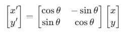

# 车牌识别
## 第一阶段（灰度->去噪->二值化）
### 一、色彩空间的线性压缩（灰度化）
1. 彩色信息对形状是别是冗余的。需要将三维向量（B，G，R）压缩成一维标量Y。
2. 数学原理：加权平均（线性变换）。OpenCV常用的转换公式是一个线性组合：Y = 0.299R + 0.587G + 0.114B。本质上是两个向量的点积：

3. cv::cvtColor(src, gray, cv::COLOR_BGR2GRAY)
``` cpp
cv::Mat src = cv::imread("plate.png");
cv::Mat gray;
cv::cvtColor(src, gray, cv::COLOR_BGR2GRAY);
```

### 二、去噪（高斯滤波-矩阵卷积）
#### 1.数学原理：卷积核（Kernel）
1. 图像中会有噪点，会干扰后面的边缘检测
2. 定义一个3 * 3或5 * 5的矩阵（算子）。比如一个简单的平滑算子：

这个小矩阵在原图大矩阵上滑动。没滑动一个位置，对应位置相乘再相加。这就是线性代数的线性平滑。
3. GaussianBlur高斯滤波
``` cpp
cv::GaussianBlur(gray, gray, cv::Size(5,5), 0);
```
意义：消除孤立的早点像素。高斯滤波比均值滤波好，因为他给中心像素更高权重，数学上更符合自然概率分布。

### 三、二值化（让机器看到”形状“）
把灰度图转为非黑即白的矩阵。
#### 1.为什么这样做？
对于车牌识别，我们不关心文字是深灰还是浅灰，只关心有没有文字。
#### 2.数学原理：阶跃函数（Step Function）
设定一个阈值T：
* 如果像素值f(x, y) > T，设为255（白）
* 如果像素值f(x, y) ≤ T，设为0（黑）
对于蓝底白字的车牌，字符和背景对比明显，通常使用**Otsu（大津法）**。其数学本质是**寻找一个阈值，**使得黑白两部分像素的类间方差最大。这实际上是在解一个**最优化问题**.
#### 3.C++实现
``` cpp
cv::Mat binary;
cv::threshold(gray, binary, 0, 255, cv::THRESH_BINARY_INV | cv::THRESH_OTSU);
```
> 注意，THRESH_BINARY_INV会将图像翻转。因为原图是蓝底（深色）白字（浅色），翻转后字符变成白色（255），背景变成黑色（0）.
> **机器识别算法通常喜欢处理”黑底白字“的情形**

## 第二阶段（定位车牌矩形与放射变换）
解决的核心问题：**如何从一堆白色像素块中准确找到那个”长方形“，并把它”扶正“？**
### 一、轮廓提取与几何筛选（Find Contours）
**二值化**后，机器看到的只有一个0和255的矩阵。我们要通过**拓扑学算法**把相连的白色像素连成一个个闭合的环（轮廓）。
1. 为什么这样做？
图像中有很多白色区域（车灯、反光）等，需要利用车牌的**几何特征**（比如长宽比接近3:1或4:1）来过滤掉不需要的干扰项。
2. C++实现
``` cpp
vector<vector<Point>> contours;
findContours(binary, contours, RETR_EXTERNAL, CHAIN_APPROX_SIMPLE);

for (const auto& cnt : contours) {
    // 获取最小外接矩形（可能带旋转角度）
    RotatedRect rect = minAreaRect(cnt);
    float aspectRatio = (float)rect.size.width / rect.size.height;
    
    // 几何筛选：长宽比通常在 2 到 5 之间
    if (aspectRatio > 2.0 && aspectRatio < 5.0 && rect.size.area() > 1000) {
        // 这极大概率就是车牌了！
    }
}
```
### 二、放射变换与矩阵旋转（Affine Transformation）
如果车牌在照片是歪的，后续的**字符切割**会非常困难。需要通过矩阵运算把它”拉直“。
#### 1.数学原理：2D旋转矩阵
将一个点(x,y)旋转θ角度，本质上是**左乘一个旋转矩阵**:

在OpenCV中，我们使用一个2 * 3的**放射变换矩阵**，它不仅能旋转，还能平移。
#### 2.为什么这样做？
为了让字符的笔画垂直于X轴和Y轴，这样才能用简单的**投影法**来切分每一个字。
#### 3.C++实现
``` cpp
// 1. 获取旋转矩阵
Mat M = getRotationMatrix2D(rect.center, rect.angle, 1.0);
// 2. 执行仿射变换（矩阵乘法）
Mat rotated;
warpAffine(src, rotated, M, src.size());
// 3. 裁剪出车牌区域
Mat plate = getRectSubPix(rotated, rect.size, rect.center);
```

