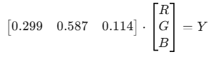
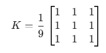

## 车牌识别
### 一、色彩空间的线性压缩（灰度化）
1. 彩色信息对形状是别是冗余的。需要将三维向量（B，G，R）压缩成一维标量Y。
2. 数学原理：加权平均（线性变换）。OpenCV常用的转换公式是一个线性组合：Y = 0.299R + 0.587G + 0.114B。本质上是两个向量的点积：

3. cv::cvtColor(src, gray, cv::COLOR_BGR2GRAY)
``` cpp
cv::Mat src = cv::imread("plate.png");
cv::Mat gray;
cv::cvtColor(src, gray, cv::COLOR_BGR2GRAY);
```

### 二、去噪（高斯滤波-矩阵卷积）
#### 1.数学原理：卷积核（Kernel）
1. 图像中会有噪点，会干扰后面的边缘检测
2. 定义一个3 * 3或5 * 5的矩阵（算子）。比如一个简单的平滑算子：

这个小矩阵在原图大矩阵上滑动。没滑动一个位置，对应位置相乘再相加。这就是线性代数的线性平滑。
3. GaussianBlur高斯滤波
``` cpp
cv::GaussianBlur(gray, gray, cv::Size(5,5), 0);
```
意义：消除孤立的早点像素。高斯滤波比均值滤波好，因为他给中心像素更高权重，数学上更符合自然概率分布。

### 三、二值化（让机器看到”形状“）
